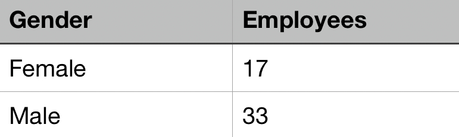
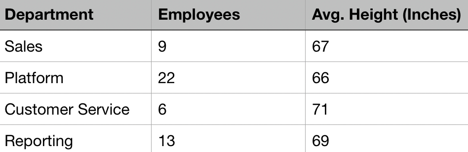
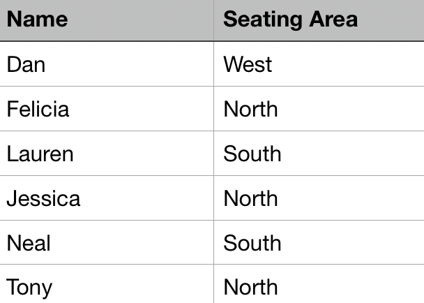

We’re going back to the basics on this one. Let me be clear: when I say “basics,” I don’t mean you should already know this. Rather, in the “I told you that story so I could tell you this one,” I want to address the former story. Understanding dimensions and metrics is fundamental to more interesting discussions down the road.

It’s easy to take some things for granted when you’re talking about data. In many cases, we get lucky and can skate on by just saying, “Oh, that thing is magic. It just works!” But when the rubber hits the road and the wheel falls off, if we haven’t taken the time to think things through all the way down, it’s hard to course correct. So, without further ado, let’s talk dimensions and metrics (we’ll hit scopes later).

The easiest way I’ve found to define them is as follows. Dimensions are qualitative, and they can be used to segment your data. Metrics are quantitative measurements that can change over time.

I find it helpful to put concepts like this into a relatable context, so I’m going to use my company as an example. We have 50 employees, give or take. Employees is a metric, and this specific metric contains an integer. We could have 52 employees next month, but we won’t have 51.5. Watching that metric change over time can help you infer how well the company is doing, but it doesn’t have much context outside of that.

To learn more about the company, we can bring in a dimension: gender. There are around 17 women and 33 men. Note that our metric doesn’t change: it’s still employees.

That’s a good dimension to be aware of when you’re looking at number of employees, especially in a tech company. What else can we pull in to learn more?

_(Note: In the interest of not giving away too much about my company - and just for the sake of not tracking all of these numbers down - I’m going to start making up numbers from here on.)_

Department makes sense in the context of a company. That’s another dimension because, in theory, it doesn’t change (what’s a re-org?) and because it can be used to split up whatever metrics we’re looking at. Speaking of metrics, what if we wanted to consider height? After all, Corporate Challenge is coming up soon, and we need a basketball team.

Turns out, though, that height is a weird metric. Employees is pretty clean: each person counts as 1. If we sum them up, we don’t run any any trouble. But if we sum up the height of a sales team, we get a mostly useless number for our purposes: we can’t have our inside sales folks piled up 15 feet tall under a cloak just dunking on everyone. That’s gonna raise some eyebrows.

Since metrics are numeric, there are more options for how to present them. You can give the sum, as I did with employees. But if you take the time to understand the context of the metric, you might find that a different calculation makes more sense. In this case, average height would be better.

A calculated metric changes based on what dimension you’re using. If you don’t pull in any dimension, the average height of the company might come out to 5’7”; however, if you pull in department, you start introducing different denominators.

It looks like the Customer Service department might be the best place to start recruiting for my basketball team. Or is it? There are only 6 people, so that average is prone to outliers. The Reporting department has more people in it, which means that an outlier will carry less weight here.

I’d like to think this illustrates dimensions versus metrics, but I hate it when an article is one example short of me really getting a concept, so let’s do a quick lightning round with our company…

- **Name:** dimension
- **Job Title:** dimension
- **Hours Worked:** metric
- **Time Off Accrued:** metric
- **Location:** dimension
- **Age:** both

One final note before moving on to scopes: metrics are tricky! Age can be aggregated and calculated, but it can also be used to segment your data. We could use age in conjunction with some metrics to figure out how the average salary of our 25 year old employees compares to that of our 35 year old folks, and we could even group several ages together into sets (e.g. 25-29, 30-34).

Now that we have a better idea of dimensions and metrics, we can move on to another concept: scope. At a high level, scope describes how broadly applicable a piece of data is. In the context of my company, there could be 3 different scopes: company, team, and employee.

The dimensions Company Name, Floor, and City would all apply across the company. We’re all on the 17th floor. We’re all in Kansas City. No matter what other dimensions or metrics you pull in alongside the company-scoped dimensions, the value of these dimensions won’t change.

Narrower scopes can be more interesting in their behavior. Let’s take a team-scoped example: the dimension Seating Area. The CS team sits in the north side of the floor. Jessica, Felicia, and Tony are all members of the CS team. If you have a table that shows the dimensions Name and Seating Area, it’s going to look like this:

Seating Area can change. We could move the CS team to the east side of the floor. But if you did, the value changes for everyone because we’re not going to just leave Tony in the middle of the new Sales team location: we like Tony enough to take him with us.

Employee scope is the most specific: these are attributes of a single employee. They could have overlapping values, but that wouldn’t imply any actual link. For example, we have 3 Ryans in my company. If you have a column of Name, we’d show up as one row (assuming you didn’t include last name). However, if I got tired of the confusion and started going by my last name, Ptomey, only I would change. You would still have a row for Ryan that represents two employees, and you’d have a new row for Ptomey.

I want to wrap this up by tying back to Google Analytics (GA). It isn’t always obvious, but dimensions in GA are governed by scopes. The most common ones you’re likely to see are hit, session, and user.

Hits are the building blocks of GA, most commonly represented in the form of pageviews and events. A single hit can have a lot of hit-scopes dimensions. A pageview, for example, has the Page Path, the Page Title, and the Hostname - 3 dimensions all with a value pertaining to that specific hit.

A session is everything in a single, unbroken visit to your site. The hidden in plain site session-scopes dimensions include Source, Landing Page, and Campaign. That’s how you can attribute conversions to a particular point of entry: everything in a given session is described by the Landing Page that it started on.

Finally, a user is one particular machine accessing the site via the same browser. GA works behind the scenes to link users across sessions, which is how we have reporting on new versus returning users. User ID is GA’s anonymous user-scoped dimension that helps stitch sessions together into a broader story. We frequently follow GA’s example by setting up user-scoped custom dimensions leveraging Member IDs from a login database, which allows us to perform our own user level analysis later.

Custom dimensions are a story for another time. At this point, my hope is that you understand dimensions, metrics, and scopes more clearly, and I hope that you can use this understanding to have better discussions with your teams and clients down the road.
