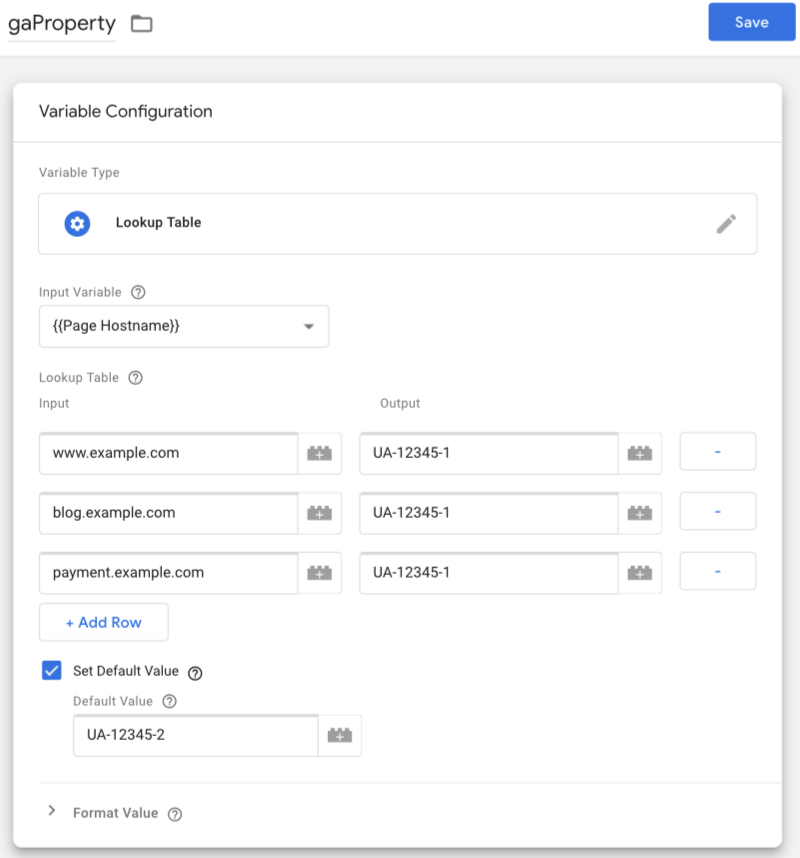
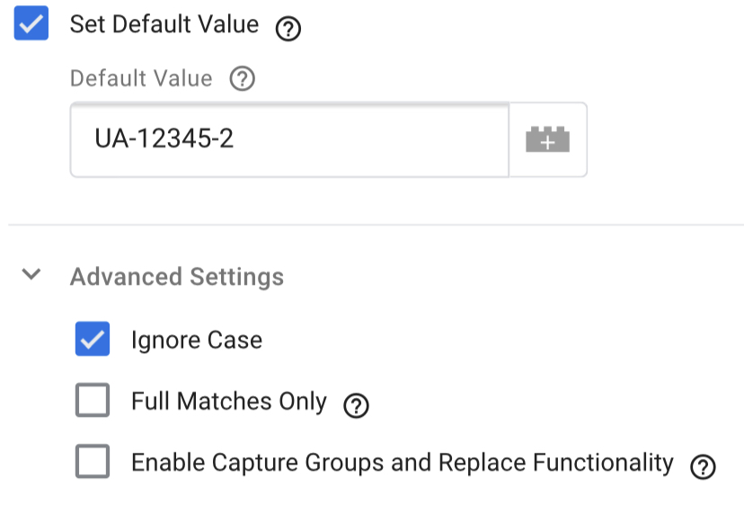

Like many people, I started learning how to use Google Tag Manager (GTM) using the tutorials in Google’s Analytics Academy. Overall, they were a good start, and I highly recommend them for anyone who wants to get into GTM. You can find it, along with several other courses, [here](https://analytics.google.com/analytics/academy/). That being said, there’s a lot of nuance that doesn’t belong in content for beginners, and there’s one piece of advice that I’d like to touch on specifically.

In lesson 2.2 of the Google Tag Manager Fundamentals course, they advise using a variable for your Google Analytics (GA) Property ID. That’s great advice! Occasionally, I’ll see a GTM container where someone didn’t take this suggestion to heart, opting instead to manually add their Property ID to every single GA-related tag. That’s fine if you never need to change your Property ID or if you only have a couple of tags setup in your container, but otherwise, you’re creating a headache for your future self. There’s a reason Google suggests that you use a variable for this ID: by changing the value of the variable, you can quickly change the ID for every tag that’s using the variable.

The Fundamentals course says to make a new variable, {{gaProperty}}, and to set it up as a Constant. That kind of variable does what it says on the tin: the value never changes (unless you change it, of course). This would work for a simple web analytics implementation where you have just one website, one Property in GA, and one GTM container, but once you bring multiple GA Properties into the mix, using {{gaProperty}} as a Constant is going to create more work for you.

For example, let’s say you want to send pageview hits for your production site to one Property and pageview hits for lower environments (dev, QA, staging, etc.) to another Property. You would need to create a second variable, {{gaProperty - Dev}}, and a second pageview tag. Ok, fine. Now, let’s say you’re setting up event tags: you want to test them out in a staging environment before publishing them. You have to create all of your event tags for the lower environment, and then you have to either duplicate them or manually switch out {{gaProperty - Dev}} for {{gaProperty}} in all of your new tags. Next thing you know, your GTM container has 200 tags, and every single trigger has to include {{Page Hostname}} as one of its conditions to make sure you’re not sending data to the wrong place.

This is unsustainable, and there’s a better way!

We’ll still use {{gaProperty}}, but instead of creating it as a Constant, we can go with either Lookup Table or RegEx Table. For the sake of simplicity, we’ll talk about it as a Lookup Table first, and I’ll cover why you might want a RegEx Table further on.

A Lookup Table has 3 key components that we’re going to use: the Input Variable, the Lookup Table itself, and the Default Value option. The Input Variable will be compared against every row in the table, and if there is an exact, positive match in the Input Column, the variable will return the corresponding item in the Output column. If no match is found and the setting is enabled, the variable will return whatever was set as a default.

For the Input Variable, choose{{Page Hostname}}. Basically, this is the combined domain and subdomain of the page. For this page that you’re reading right now, it would be www.ryanptomey.com.

Next, enter as many rows as you need to capture all the hostnames for your production site. Let’s say example.com has a main site but also has blog and payment subdomains. You would need to include 3 rows, as seen below, and each row should use the Property ID that you’ve designated for your production data.

The last piece is including a default value of the Property ID you’re going to use as a catch-all for any lower environment data. I used to set these up the opposite way, including rows for staging.example.com, qa.example.com, and so on, but I found that developers don’t always clue you in when they spin up a new testing environment. Production domains are much less likely to suddenly appear or disappear (unless you’ve got a really bad relationship with your client), and even then, it’s less harmful to accidentally send production data to your dev property than to mix testing data with your reporting data.

I noted earlier that there are times you might want to use a RegEx Table instead. If you don’t know anything about RegEx, this [tutorial](https://regexone.com/) is a great entry point. That being said, this type of variable is going to give you more flexibility than the exact matches of the Lookup Table can offer. Here are a couple use cases:

The main site doesn’t always redirect example.com to www.example.com. In this case, you could capture both with ^(www)?\.example\.com$

The page path also needs to be considered when routing. If the first portion of your page path always includes a country code and you need countries separated at the property level in GA, you could use {{Page URL}} as your Input Variable instead and capture each country with something like ^https:\/\/www\.example\.com\en-us\/

A lot of subdomains exist but you don’t want to add a bunch of rows. In this case, you could get all 3 from my previous example with ^(blog|payment|www)\.example\.com$

Finally, there’s one big point of caution on the RegEx Table Variable. Google hid a couple of settings that can really throw you if you’re not aware of them. Right below the default checkbox, there’s an Advanced Settings dropdown that significantly changes how the variable behaves. I recommend this configuration:

Whatever type of variable you ultimately choose to go with, I hope this helps save you some work in the future.
