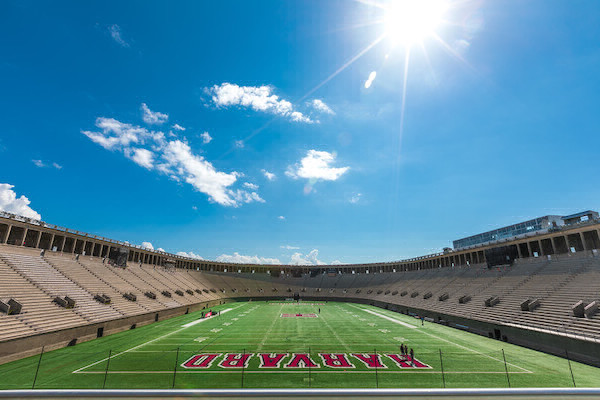
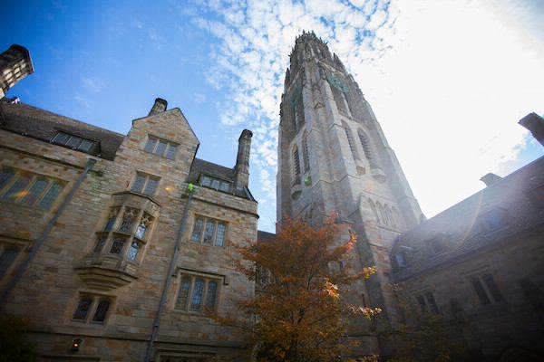

## Project Abstract
The fifth week of Harvard's [cs50x course](https://cs50.harvard.edu/x/2021/) goes deeper into coding in C, introducing hexadecimal numbering, working with files, and managing memory. Students were given two homework assignments, and the former offered two levels of difficulty to pick from.

In this assignment, we were tasked with writing helper functions for a larger image filtering project. The base code simply read command line arguments to copy a bitmap image from one file into a new file. Our helper functions would be called to run the image through 4 different types of filters: grayscale, horizontal reflection, blur, and edge detection. In this assignment, we were instructed to leverage [Sobel operators](https://en.wikipedia.org/wiki/Sobel_operator) for detecting edges.

## Project Deliverable

```c
#include "helpers.h"
#include <math.h>

// Convert image to grayscale
void grayscale(int height, int width, RGBTRIPLE image[height][width])
{
    for (int i = 0; i < height; i++)
    {
        for (int j = 0; j < width; j++)
        {
            int blue = image[i][j].rgbtBlue;
            int green = image[i][j].rgbtGreen;
            int red = image[i][j].rgbtRed;

            int avg = round(((float) blue + green + red) / 3);

            image[i][j].rgbtBlue = avg;
            image[i][j].rgbtGreen = avg;
            image[i][j].rgbtRed = avg;
        }
    }
    return;
}

// Reflect image horizontally
void reflect(int height, int width, RGBTRIPLE image[height][width])
{
    for (int i = 0; i < height; i++)
    {
        for (int j = 0, n = (int) ceil(width / 2); j < n; j++)
        {
            RGBTRIPLE temp = image[i][j];
            image[i][j] = image[i][width - j - 1];
            image[i][width - j - 1] = temp;
        }
    }
    return;
}

// Blur image
void blur(int height, int width, RGBTRIPLE image[height][width])
{
    // Declare a new array that we'll use to preserve the original values, which are needed for the calculations.
    RGBTRIPLE originalColors[height][width];

    // Fill originalColors array.
    for (int i = 0; i < height; i++)
    {
        for (int j = 0; j < width; j++)
        {
            originalColors[i][j] = image[i][j];
        }
    }

    for (int i = 0; i < height; i++)
    {
        for (int j = 0; j < width; j++)
        {
            int pixels = 0;
            int blueTotal = 0;
            int greenTotal = 0;
            int redTotal = 0;

            // Look at a mini 3x3 grid including the pixel and its neighbors.
            for (int k = -1; k < 2; k++)
            {
                for (int l = -1; l < 2; l++)
                {
                    int tempY = i + k;
                    int tempX = j + l;
                    if (tempY >= 0 && tempY < height && tempX >= 0 && tempX < width)
                    {
                        pixels++;
                        blueTotal += originalColors[tempY][tempX].rgbtBlue;
                        greenTotal += originalColors[tempY][tempX].rgbtGreen;
                        redTotal += originalColors[tempY][tempX].rgbtRed;
                    }
                }
            }

            // Get the average for each color based on totals and pixels included, then write to image pixel.
            image[i][j].rgbtBlue = round((float) blueTotal / pixels);
            image[i][j].rgbtGreen = round((float) greenTotal / pixels);
            image[i][j].rgbtRed = round((float) redTotal / pixels);
        }
    }

    return;
}

// Detect edges
void edges(int height, int width, RGBTRIPLE image[height][width])
{
    // Declare a new array that we'll use to preserve the original values, which are needed for the calculations.
    RGBTRIPLE originalColors[height][width];

    // Fill originalColors array.
    for (int i = 0; i < height; i++)
    {
        for (int j = 0; j < width; j++)
        {
            originalColors[i][j] = image[i][j];
        }
    }

    for (int i = 0; i < height; i++)
    {
        for (int j = 0; j < width; j++)
        {
            // Enable using a loop by putting the Sobel multiplication factors in an array.
            // For both x and y factors, this travels left to right, top to bottom.
            int factorIndex = 0;
            int xFactors[] = {-1, 0, 1, -2, 0, 2, -1, 0, 1};
            int yFactors[] = {-1, -2, -1, 0, 0, 0, 1, 2, 1};

            // Sums live outside the upcoming 3x3 grid loop.
            int xBlueSum = 0;
            int yBlueSum = 0;
            int xGreenSum = 0;
            int yGreenSum = 0;
            int xRedSum = 0;
            int yRedSum = 0;

            // Look at a mini 3x3 grid including the pixel and its neighbors.
            for (int k = -1; k < 2; k++)
            {
                for (int l = -1; l < 2; l++)
                {
                    int tempY = i + k;
                    int tempX = j + l;
                    if (tempY >= 0 && tempY < height && tempX >= 0 && tempX < width)
                    {
                        // Get the factors so we don't have to keep checking the array for every calculation.
                        int xFactor = xFactors[factorIndex];
                        int yFactor = yFactors[factorIndex];

                        xBlueSum += originalColors[tempY][tempX].rgbtBlue * xFactor;
                        xGreenSum += originalColors[tempY][tempX].rgbtGreen * xFactor;
                        xRedSum += originalColors[tempY][tempX].rgbtRed * xFactor;

                        yBlueSum += originalColors[tempY][tempX].rgbtBlue * yFactor;
                        yGreenSum += originalColors[tempY][tempX].rgbtGreen * yFactor;
                        yRedSum += originalColors[tempY][tempX].rgbtRed * yFactor;
                    }

                    // If something lies outside the boundaries, we're treating it as 0 across the board.
                    // But we still want to increase the factorIndex so that we can handle the next pixel appropriately.
                    factorIndex++;
                }
            }

            // Calculate the values for RGB/BGR based on Sobel formula.
            int sobelBlue = round(sqrt(pow(xBlueSum, 2) + pow(yBlueSum, 2)));
            int sobelGreen = round(sqrt(pow(xGreenSum, 2) + pow(yGreenSum, 2)));
            int sobelRed = round(sqrt(pow(xRedSum, 2) + pow(yRedSum, 2)));

            // For each color, cap the value at 255.
            if (sobelBlue > 255)
            {
                image[i][j].rgbtBlue = 255;
            }
            else
            {
                image[i][j].rgbtBlue = sobelBlue;
            }

            if (sobelGreen > 255)
            {
                image[i][j].rgbtGreen = 255;
            }
            else
            {
                image[i][j].rgbtGreen = sobelGreen;
            }

            if (sobelRed > 255)
            {
                image[i][j].rgbtRed = 255;
            }
            else
            {
                image[i][j].rgbtRed = sobelRed;
            }
        }
    }
    return;
}
```

## Notes and Credits
Thanks to members of the cs50 Discord for helping me catch my "off by one" errors.

## Project Details and Discussion
This may have been my favorite homework assignment thus far. I was nervous going into it, but everything clicked together for me pretty quickly.

The **grayscale filter** was relatively straightforward and just required finding the average of each pixel's RGB values, then setting all 3 to that average. For example, a pixel of red 40, green 50, and blue 60 would have all 3 set to the average of 50. I did have to include `<math.h>` so that I could leverage its rounding function, but it proved useful for the other filters as well.

The **reflection filter** was an interesting problem to tackle because running the logic all the way across each row of pixels would have simply resulted in a copy of the original, unaltered image. To elaborate, I did want to flip the first pixel with the last, but if I kept flipping them all the way, the last thing I did would be flipping the last pixel back to the first position. Setting my loop to run up to, but not including `n = (int) ceil(width / 2)` solved this problem, and this solution worked for both even and odd pixel widths.

The **blur filter** required a lot of creativity. Essentially, the blur was executed by finding the average color between a pixel and each of its neighbors, then setting the pixel to that average.

The first challenge was that I had to keep the original colors while also updating the new image. If I didn't preserve the originals, I would imagine that the image would have become more and more distorted with each pixel affected.

The second challenge was figuring out how to algorithmically travel to each pixel's neighbors. I was very pleased with my solution of using a pair of nested loops that each ran for integers set to `-1`, then `0`, then `1`. With these values, I could then take the current pixel's `xy` coordinates and loop through everything from `x-1, y-1` to `x+1, y+1`. From there, the only thing I had to do was ignore the `xy` coordinates if they would exist outside of the image.

The **edge filter** benefitted a lot from coming after the blur filter. The biggest challenge here came from the formula's requirement of creating two 3x3 kernels for each color channel (i.e. red, green, and blue), then applying different math to each position. In the blur filter, I was able to treat all of the neighbor's equally. In this case, however, I had to multiply numbers in each position by these values:


I suppose I could have found a way to do this manually, without loops, but I thought it would be smarter to create two flattened arrays of the factors: `int xFactors[] = {-1, 0, 1, -2, 0, 2, -1, 0, 1};` and `int yFactors[] = {-1, -2, -1, 0, 0, 0, 1, 2, 1};`. My nested loops were already going from left to right, then from top to bottom. With those in place, I simply used a counter to remember which factor I needed to multiply by.

Outside of that problem, the rest was mostly just a bunch of math needed to eventually get to the Sobel formula of `round(sqrt(pow(xBlueSum, 2) + pow(yBlueSum, 2)))`, then overwrite each pixel's color accordingly while observing a maximum color value of 255.

With all that said, here are the results of each filter...

### Grayscale Filter
Before:


After:


### Reflection Filter
Before:


After:


### Blur Filter
Before:


After:


### Edge Filter
Before:


After:

