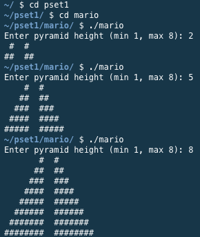

## Project Abstract
The second week of Harvard's [cs50x course](https://cs50.harvard.edu/x/2021/) asks students to start working in actual, written code using C. Students were given two homework assignments, each with two levels of difficulty to pick from.

Assignment 1's harder option was to write a code that would accept an integer input between 1 and 8, then generate a pyramid of that height, based on the pyramid seen in World 1-1 of Super Mario Bros. (NES).


As seen in the game, a pyramid with a height of 4 would have a base level of 4 blocks, 2 empty spaces, and 4 more blocks. Each ascending row decreases the number of blocks on each sides of the gap by 1. Regardless of height, the 2 space gap should be a constant feature.

## Project Deliverable

```c
#include <stdio.h>
#include <cs50.h>

// Establish the function(s) early so that compiling doesn't fail.
void makeBlocks(int n, string s);

int main(void)
{
    // Get the size from the user
    int height;
    do
    {
        height = get_int("Enter pyramid height (min 1, max 8): ");
    }
    while (height < 1 || height > 8);

    for (int i = 0; i < height; i++)
    {
        // Each row requires a different number of bricks and blanks,
        // but the number of blanks and bricks on each side must sum to the height.
        int bricks = i + 1;
        int blanks = height - bricks;

        makeBlocks(blanks, " ");
        makeBlocks(bricks, "#");
        makeBlocks(2, " ");
        makeBlocks(bricks, "#");
        printf("\n");
    }
}

// Catchall function for printing any number of any character.
void makeBlocks(int n, string s)
{
    for (int j = 0; j < n; j++)
    {
        printf("%s", s);
    }
}
```

## Notes and Credits
Thanks to David Malan for calling out that a function referenced inside of the `main` function would cause compiling to fail unless established prior to it - and also for the tip that you can then write the actual function code further below.

## Project Details and Discussion
This project was definitely the simpler of the two for this week, so I can't think of anything I would change about it outside of small, nitpicky things.

I was happy with myself for realizing that I could just use one `makeBlocks` function to handle both bricks and blank spaces.

One item I could have explored is whether it would have been better to pass characters to the function instead of single character strings, but this is working as expected and is a pretty small program, so I would have to imagine any difference is negligible.

Because this project leveraged the `cs50.h` header file, which is not available outside of the program's online IDE, [JDoodle](https://www.jdoodle.com/) was not able to compile the code, so I can't embed a working example here. However, here is an example of the input and output:

