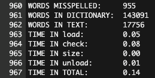

## Project Abstract
The sixth week of Harvard's [cs50x course](https://cs50.harvard.edu/x/2021/) felt like a capstone for our time with C. All students were given a single homework assignment that leveraged concepts from arrays and working with strings to reading from files and building hash tables.

As has been the case with some of our larger projects, we only had to concern ourselves with a portion of the code. In this case, we had to update the file `dictionary.c`. It contained 5 functions that we had to build out: `load`, `hash`, `check`, `size`, and `unload`.

The `load` function opened and read from dictionary files, then put each word of the dictionary into a hash table. The `check` function accepted a single word, which it would then compare to the values in the hash table to confirm whether it was a recognized spelling of a word.

The `hash` function was used on both building the table and checking words against it. This function returned an integer derived from the word and had to consistently return the same value for any given word, no matter how many times it was hashed.

The `size` function merely had to return the number of words stored in the dictionary.

And finally, the `unload` function had to clean up all of the memory allocated to storing the dictionary in a hash table.

## Project Deliverable

```c
// Implements a dictionary's functionality
#include <stdbool.h>
#include <math.h>
#include <string.h>
#include <strings.h>
#include <stdio.h>
#include <stdlib.h>
#include "dictionary.h"

// Represents a node in a hash table
typedef struct node
{
    char word[LENGTH + 1];
    struct node *next;
}
node;

// Number of buckets in hash table
const unsigned int N = 200000;

// Hash table
node *table[N];

// Keep track of dictionary size.
int word_count = 0;

// Returns true if word is in dictionary, else false
bool check(const char *word)
{
    int hash_num = hash(word);

    for (node *tmp = table[hash_num]; tmp != NULL; tmp = tmp->next)
    {
        if (strcasecmp(tmp->word, word) == 0)
        {
            return true;
        }
    }

    return false;
}

// Hashes word to a number
unsigned int hash(const char *word)
{
    // Initialize a sum and the hash function return as 0.
    int sum = 0;
    int hash_result = 0;

    // Initialize counter for while loop.
    int i = 0;

    // Convert up to 16 characters, starting at the left side of the word, into an integer expressed in binary.
    // My hope is that there will be a better distribution if short words end up closer to the middle of the possible range of values.
    // For example, "cat" has values of 99, 97, and 116.
    // Taking those values % 2 returns 1, 1, and 0 respectively.
    // We'll effectively turn this into the same value as 1100000000000000, which is 49152.
    // Since we may not have 49k+ buckets in our hash table, then we'll do that value % N to get a number that fits our cap.
    while (word[i] != 0 && i < 16)
    {
        int asciiVal = (int) word[i];

        // Make sure we always hash letters based on the lowercase.
        if (asciiVal >= 65 && asciiVal <= 90)
        {
            asciiVal += 32;
        }

        int modVal = asciiVal % 2;
        int positionVal = pow(2, (15 - i)) * modVal;

        sum += positionVal;

        i++;
    }

    hash_result = sum % N;

    return hash_result;
}

// Loads dictionary into memory, returning true if successful, else false
bool load(const char *dictionary)
{
    FILE *dict_file = fopen(dictionary, "r");

    if (dictionary == NULL)
    {
        printf("Could not open %s.\n", dictionary);
        return false;
    }

    char buffer[LENGTH + 1];

    while (fscanf(dict_file, "%s", buffer) != EOF)
    {
        node *w = malloc(sizeof(node));

        // Make sure the memory got allocated.
        if (w == NULL)
        {
            return false;
        }

        // Put the word into the node's word value.
        strcpy(w->word, buffer);

        // Hash the word and store the int so that we don't have to repeat this.
        int hash_num = hash(buffer);

        // So that we don't lose our whole linked list, we set this node's next value to whatever is currently first...
        // ...and then we reassign the first node in the linked list to this one.
        w->next = table[hash_num];
        table[hash_num] = w;

        // Iterate our total word count.
        word_count++;

    }

    fclose(dict_file);
    return true;
}

// Returns number of words in dictionary if loaded, else 0 if not yet loaded
unsigned int size(void)
{
    return word_count;
}

// Unloads dictionary from memory, returning true if successful, else false
bool unload(void)
{
    for (int i = 0; i < N; i++)
    {
        node *cursor = table[i];

        while (cursor != NULL)
        {
            node *tmp = cursor;
            cursor = cursor->next;
            free(tmp);
        }

        // Check if we're done.
        if (cursor == NULL && i == N - 1)
        {
            return true;
        }
    }

    return false;
}

```

## Notes and Credits
Thank you to Professor David Malan for giving us the instruction necessary to complete this program.

## Project Details and Discussion
Because of the scope of this file, I can't embed a full working example. However, here is a sample of the output of the code run against the script of the film La La Land:

