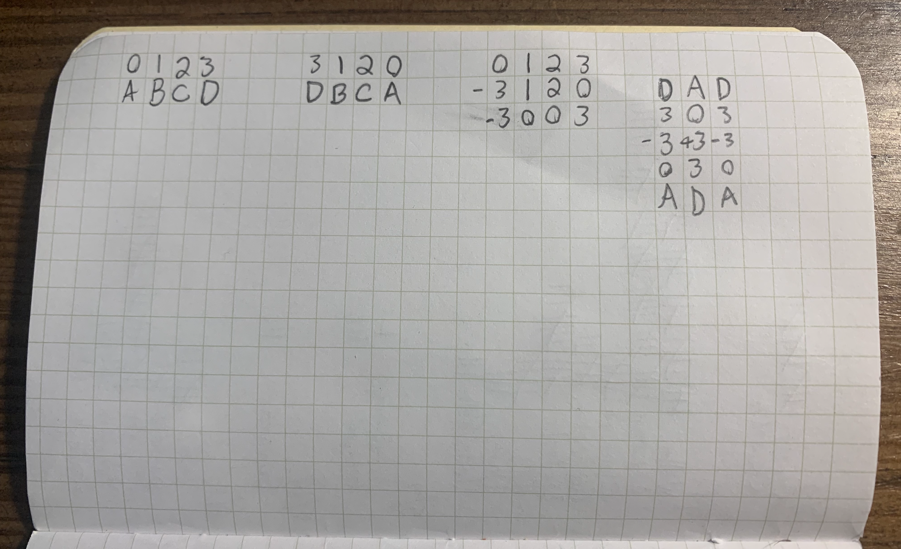
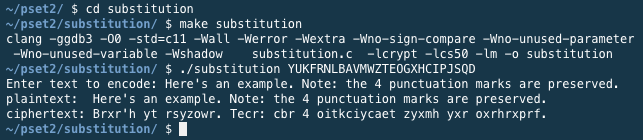

## Project Abstract
The third week of Harvard's [cs50x course](https://cs50.harvard.edu/x/2021/) goes deeper into coding in C, introducing both arrays and command line arguments. Students were given two homework assignments, and the latter offered two levels of difficulty to pick from.

Assignment 2's harder option was to write a code that would require a single, valid command line argument, which would be used as the key to a substitution cipher. Once running, the code asks the user for a string input, then prints the encoded text.

We were only concerned with substitution of alphabet characters, so spacing, numbers, and punctuation should be left intact. Additionally, we were required to maintain the original casing of each letter. Given these requirements, a valid key was defined as one that included a single instance of every letter of the alphabet, ignoring casing.

## Project Deliverable

```c
#include <stdio.h>
#include <cs50.h>
#include <string.h>
#include <ctype.h>

// These will be used to abort the program early if need be.
bool is_key_present(int n);
bool is_key_valid(string s);

// Just for utility.
string get_lowercase(string t);

// The real magic happens in this one.
string encode(string u, string v);

int main(int argc, string argv[])
{
    // Make sure there's a command line argument for the key.
    if (is_key_present(argc))
    {
        // Then make sure it's the right length.
        // Should comprise the full alphabet.
        if (strlen(argv[1]) == 26)
        {
            // In terms of the cipher, there aren't different options
            // for uppercase and lowercase, so let's make the key all
            // in one case before we start final checks and encoding.
            string lowercaseKey = get_lowercase(argv[1]);

            // One last check to make sure it comprises all 26 letters - no more, no less.
            if (is_key_valid(lowercaseKey))
            {
                string plainText = get_string("Enter text to encode: ");
                // Rather than try to preserve the original,
                // just print it immediately.
                printf("plaintext:  %s\n", plainText);

                // Knowing that cipherText and plainText are referring to the same
                // location in memory, I probably don't need to give it another name,
                // but this works, so I'm not going to mess with it.
                string cipherText = encode(plainText, lowercaseKey);
                printf("ciphertext: %s\n", cipherText);
                return 0;
            }
            else
            {
                printf("ERROR: Invalid key.\n");
                return 1;
            }
        }
        else
        {
            printf("ERROR: Expected 26 character key.\n");
            return 1;
        }

    }
    else
    {
        printf("ERROR: Expected 1 key.\n");
        return 1;
    }
}

bool is_key_present(int n)
{
    if (n == 2)
    {
        return true;
    }
    else
    {
        return false;
    }
}

bool is_key_valid(string s)
{
    int letterPresence[26] = {0};

    for (int i = 0, n = strlen(s); i < n; i++)
    {
        char c = s[i];

        if (isalpha(c))
        {
            letterPresence[c - 'a'] += 1;
        }
        else
        {
            return false;
        }
    }

    for (int j = 0; j < 26; j++)
    {
        if (letterPresence[j] != 1)
        {
            return false;
        }
    }

    return true;
}

// In the rare occasion that I want the whole string
// to be lowercase instead of a single character...
string get_lowercase(string t)
{
    // Unfortunately, even though I declared temp
    // this will still overwrite the original
    // string passed as input to the function.
    string temp = t;

    for (int i = 0, n = strlen(temp); i < n; i++)
    {
        if (isupper(temp[i]))
        {
            temp[i] = tolower(temp[i]);
        }
    }

    return temp;
}

string encode(string u, string v)
{
    string entry = u;
    string key = v;
    string alphabet = "abcdefghijklmnopqrstuvwxyz";
    int difference[26] = {0};

    for (int i = 0; i < 26; i++)
    {
        difference[i] = alphabet[i] - key[i];
    }

    for (int j = 0, n = strlen(entry); j < n; j++)
    {
        if (isalpha(entry[j]))
        {
            int x = 0;
            if (entry[j] >= 'A' && entry[j] <= 'Z')
            {
                x = entry[j] - 'A';
            }
            else if (entry[j] >= 'a' && entry[j] <= 'z')
            {
                x = entry[j] - 'a';
            }
            entry[j] = entry[j] - difference[x];
        }
    }

    return entry;
}
```

## Notes and Credits
I am thankful to my Discord server for helping me understand why my initial approach to the string encoding was overwriting the original string and also losing track of character casing.

## Project Details and Discussion
Shockingly, most of this code was easy to plan out and write. We had already done some work with functions and validating text, so it was just a matter of doing each check before proceeding further. I leveraged functions to make my `main()` function more concise, which did provide some good practice in writing functions that would take input and return information.

Figuring out how to actually encode text based on the key was an interesting puzzle. I ended up resorting to creating a short cipher on paper so that I could see how the math might work:


I assigned `A-D` to the integers `0-3`. Then, I set my key as `DBCA` and wrote the values for each of those characters. Next, I created an array of differences: `[-3, 0, 0, 3]`. Here, `B` and `C` were unchanged, so their differences were `0`. Meanwhile, `A` was 3 lower than `D`, and `D` was 3 higher than `A`. Finally, I put the string `DAD` into this key and wound up with a result of `ADA`.

The hardest part of the project was actually making sure I didn't overwrite the original string. Something I didn't realize when I started was that C's memory allocation behavior means that running a function on a string will still refer to the original location in memory, even if trying to create a new string from it. Long story short, I ultimately decided to print out the original string before running the cipher, making it unnecessary to try to preserve the original string all the way to the end of the program. I understand that subsequent weeks of the program will be discussing memory; however, I'm not there yet at this point.

Because this project leveraged the `cs50.h` header file, which is not available outside of the program's online IDE, [JDoodle](https://www.jdoodle.com/) was not able to compile the code, so I can't embed a working example here. However, here is an example of the input and output:

