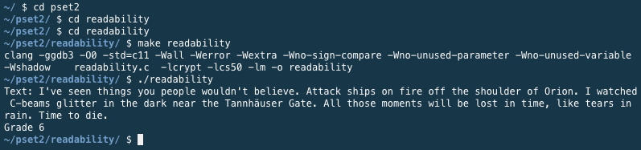

## Project Abstract
The third week of Harvard's [cs50x course](https://cs50.harvard.edu/x/2021/) goes deeper into coding in C, introducing both arrays and command line arguments. Students were given two homework assignments; however, the former offered only one level of difficulty.

Assignment 1 was to write a code that would accept a string, then run it through the [Coleman-Liau index](https://en.wikipedia.org/wiki/Coleman%E2%80%93Liau_index) in order to estimate what United States grade level is needed to understand the text. The formula is:
`index = 0.0588 * L - 0.296 * S - 15.8`

In this formula, `L` represents the number of letters per 100 words in the text, and `S` represents the average number of sentences per 100 words. Because we couldn't reasonably expect to get entries of exactly 100 words, we had to be able to support any length of text.

## Project Deliverable

```c
#include <stdio.h>
#include <cs50.h>
#include <string.h>
#include <ctype.h>
#include <math.h>

int count_letters(string s);
int count_spaces(string s);
int count_sentences(string s);
float calculate_index(int j, int k, int l);

int main(void)
{
    string text = get_string("Text: ");

    int alphaNumChars = count_letters(text);

    // Since spaces divide words, there will always be 1 more word than the number of spaces.
    int words = count_spaces(text) + 1;

    // Rough count using the number of periods, exclamation points, and question marks.
    int sentences = count_sentences(text);

    // Run through Coleman-Liau index, then round to nearest integer.
    int index = round(calculate_index(alphaNumChars, words, sentences));

    // Only get specific if grade level falls between 1 and 15.
    if (index >= 16)
    {
        printf("Grade 16+\n");
    }
    else if (index < 1)
    {
        printf("Before Grade 1\n");
    }
    else
    {
        printf("Grade %i\n", index);
    }
}

int count_letters(string s)
{
    int counter = 0;

    // Looking for A-Z, a-z, and 0-9.
    for (int i = 0, n = strlen(s); i < n; i++)
    {
        if (isalnum(s[i]))
        {
            counter += 1;
        }
    }

    return counter;
}

int count_spaces(string s)
{
    int counter = 0;

    for (int i = 0, n = strlen(s); i < n; i++)
    {
        // Every instance of whitespace will count.
        // No need to check for doublespaces in our examples.
        if (isspace(s[i]))
        {
            counter += 1;
        }
    }

    return counter;
}

int count_sentences(string s)
{
    int counter = 0;

    for (int i = 0, n = strlen(s); i < n; i++)
    {
        // This will have some false positives in the case of "Mr.", "Ltd.", elipses, and the like.
        // However, for the assignment, we're ignoring those outliers.
        if (s[i] == '.' || s[i] == '!' || s[i] == '?')
        {
            counter += 1;
        }
    }

    return counter;
}

float calculate_index(int j, int k, int l)
{
    // The formula needs average letters and sentences per 100 words.
    // Since we can't expect to get an even 100 words every time,
    // we need to divide letters or sentences by the number we have,
    // then multiply by 100.

    float avgLetters = j / (float) k * 100;

    float avgSentences = l / (float) k * 100;

    float index = 0.0588 * avgLetters - 0.296 * avgSentences - 15.8;

    return index;
}
```

## Notes and Credits
Thank you to Professor David Malan for giving us the instruction necessary to complete this program.

## Project Details and Discussion
Because this project leveraged the `cs50.h` header file, which is not available outside of the program's online IDE, [JDoodle](https://www.jdoodle.com/) was not able to compile the code, so I can't embed a working example here. However, here is an example of the input and output:

