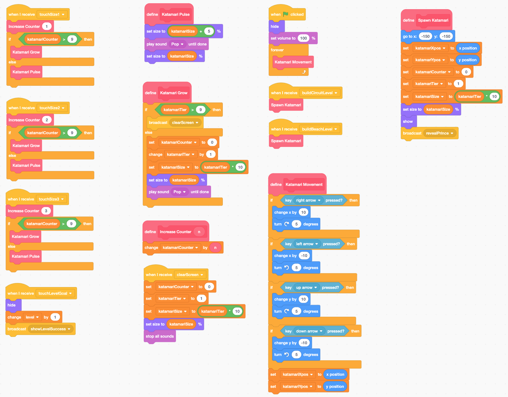
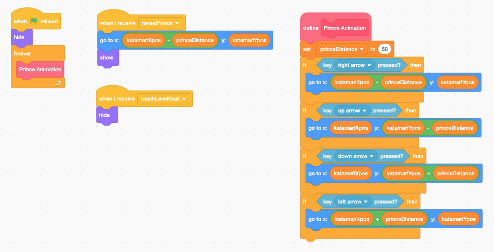
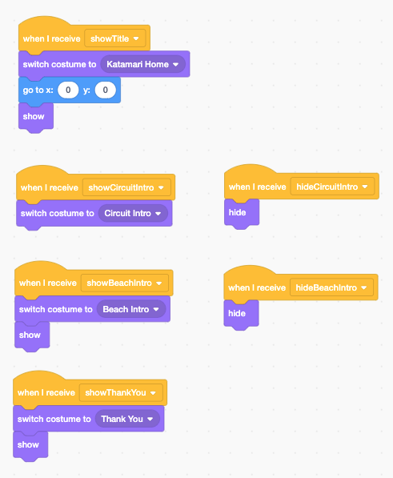
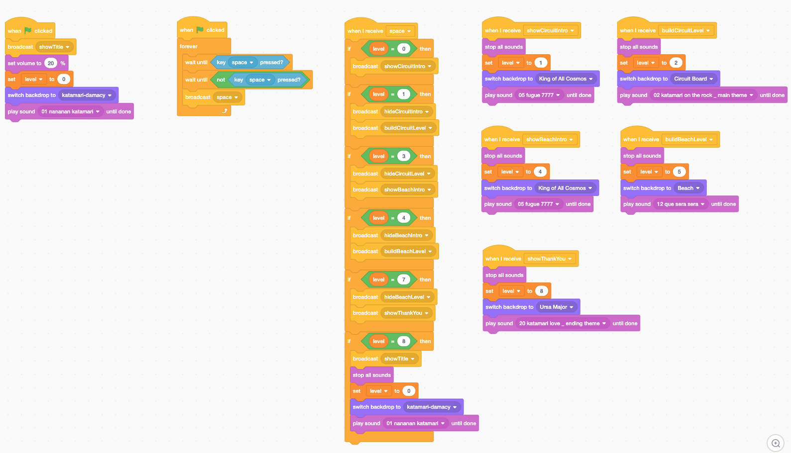
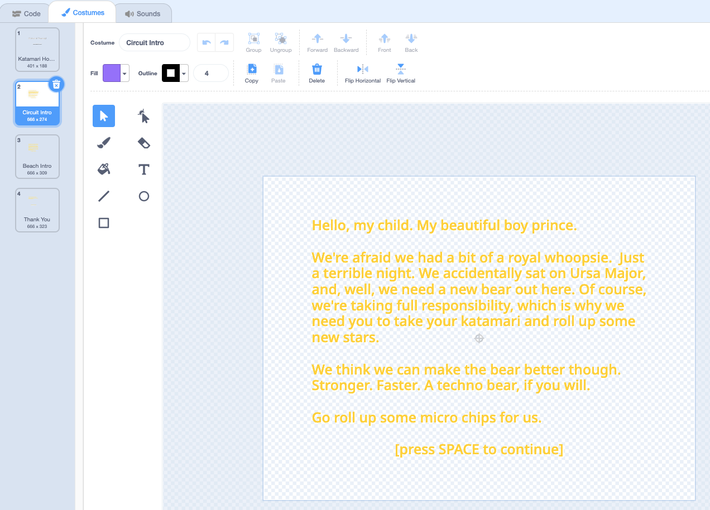
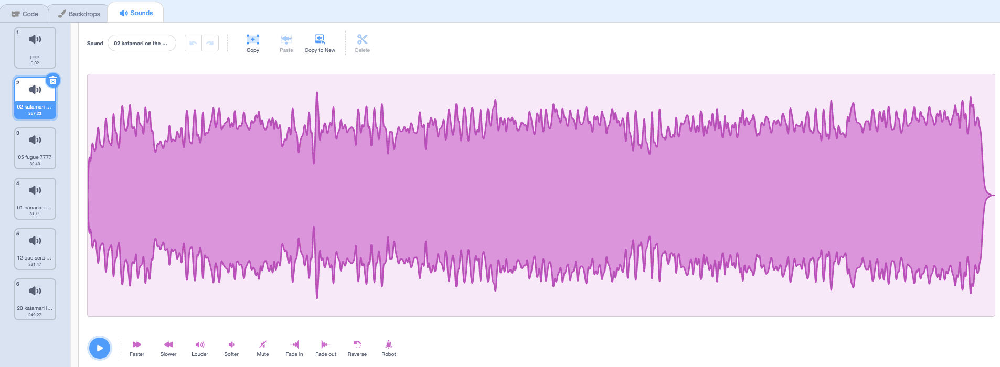

## Project Abstract
The very first week of Harvard's [cs50x course](https://cs50.harvard.edu/x/2021/) introduces [Scratch](https://scratch.mit.edu/), a visual programming language developed by MIT. After a quick crash course, we were asked to create any project of our choice (e.g. an interactive story, game, animation) subject to handful of technical requirements (at least one loop, at least one sound, etc.).

## Project Deliverable
### Instructions
> The King of All Cosmos broke Ursa Major, and now it's up to you to find replacement stars!
>
> Use the arrow keys to help the Prince move his katamari ball around the levels until it's big enough to undo your father's destruction.
>
> Your katamari starts small, but as you roll up more things, you'll be able to roll up bigger and bigger items.
>
> The level ends when you manage to roll up the largest item of all.

<iframe src="https://scratch.mit.edu/projects/528029760/embed" allowtransparency="true" width="485" height="402" frameborder="0" scrolling="no" allowfullscreen></iframe>

## Notes and Credits
Big thanks to Namco for giving the world the weird, delightful series that is Katamari Damacy. If you haven't had the opportunity to play one of the games, please treat yourself!

## Project Details and Discussion
Scratch is based on two different primary assets: sprites and backgrounds. Each of these can have code associated with it. Below are examples of the code governing behavior for the katamari ball, the Prince, the text being displayed to the user, and the background of each level or interstitial screen...

The katamari was probably the most complicated piece of the program, and the biggest challenge I faced was getting it to pulse as intended when picking up multiple pieces in a short amount of time. Initially, my thought was to increase it in size by 5 points, then immediately shrink it by 5 points again. In theory, this should have worked, but in practice, I would often find it growing by 30 points, then only shrinking by 5.

The katamari also includes logic that I included to make sure it was big enough to pick up an item, although the responsibility was also shared with the item pick-ups. Rather than try to measure different sizes here, I made sure that each item would only broadcast to the katamari if the global size variable were high enough.

Here is the katamari's code:

The main challenge for the Prince was making sure that he stayed in close proximity to the katamari and stayed on the correct side, based on the direction that it was being rolled in, to convey the idea that he was pushing it around the level. If I had had more time, I might have added logic around layering to make sure he didn't get hidden as the katamari grew in size. I might also have attempted to move the Prince to diagonal positions when two arrow keys were pressed.

Here is the Prince's code:

I had to represent text as a sprite, which never did quite feel natural. It strikes me that text could be an additional asset type, similar to backgrounds; however, I'm sure MIT had a reason for keeping Scratch down to two asset types like this.

Here is the code that governed when text was displayed:

I used the background code to govern the advancement through the levels, including accepting presses of the Space key to continue. I was surprised that this actually represented the biggest headache of the project. Early on, I could only get the program to register a single press of the button, but eventually I arrived on the solution seen in the second and third columns. Rather than use the built-in "when 'Space' key is pressed" event, I added a forever loop to wait for the Space key to be pressed, then released, before broadcasting a "space" event.

Here is the background code:

In addition to code, the sprites and backgrounds could have different visual appearances (aka costumes) and sounds associated with them...

The text, for example, had several different costumes. Each represented a different message that I wanted to display to the user, ranging from the intro screen to level introductions to the final thank you:

I was also able to upload sounds, so I chose some of my favorite tracks from the original Katamari Damacy soundtrack:

